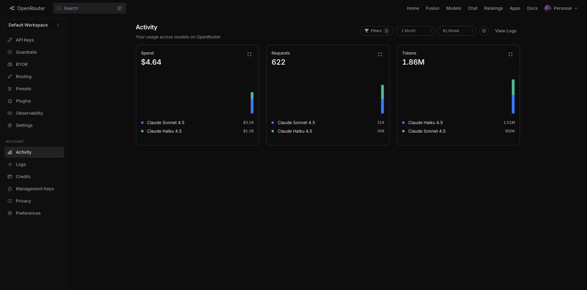
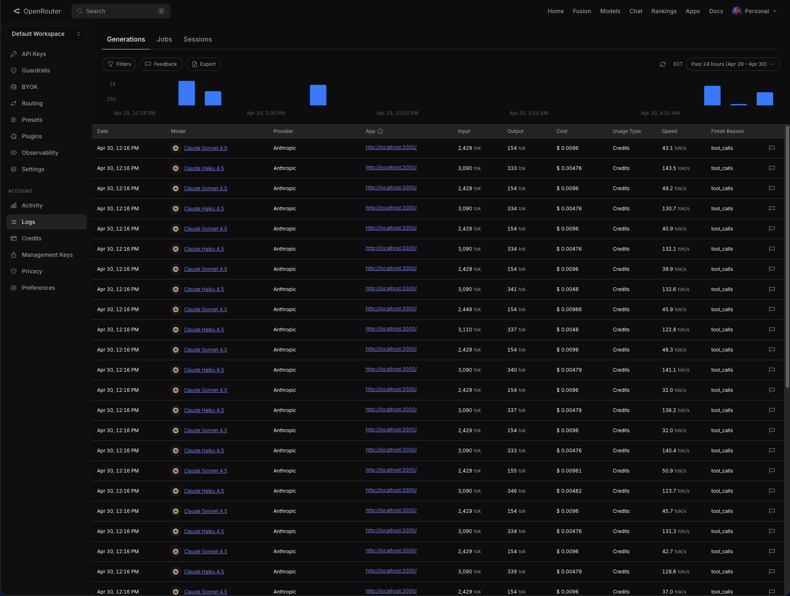

# TTB Label Verifier

> Compare alcohol label artwork to TTB application data — single labels in <5s, batches of 200–300 with live progress and CSV export.

- **Live demo:** https://alcohol-label.vercel.app/
- **Repo:** this repository

This is a take-home prototype for the TTB Compliance Division reviewer flow described in `dev-docs/brief.txt`. The goal is a working core that a senior reviewer could actually use, with the warning verification airtight and smart-match transparent.

---

## Quick start

Requirements: [Bun](https://bun.sh) and Node 22.

```bash
git clone <this repo>
cd alcohol-label
bun install
cp .env.example .env.local      # fill in OPENROUTER_API_KEY at minimum
bun dev                         # http://localhost:3000
```

Open `/` for single labels, `/batch` for batch mode, `/about` for how-it-works.

### Useful commands

```bash
bun run build           # production build
bun run test            # all unit tests (vitest)
bun run lint            # biome check
bunx tsc --noEmit       # type check
```

---

## Architecture

```
 ┌─────────────┐     ┌──────────────────────┐     ┌────────────┐     ┌──────────────────┐
 │  Browser    │     │  Next.js (Vercel)    │     │ OpenRouter │     │ Anthropic Claude │
 │             │     │                      │     │            │     │                  │
 │  shadcn UI  ├────▶│  Server Action       ├────▶│  /chat/    ├────▶│  Haiku 4.5       │
 │  RHF + Zod  │     │  /api/verify-one     │     │ completions│     │  Sonnet 4.5      │
 │  IndexedDB  │     │                      │     │            │     │                  │
 └─────────────┘     │  lib/verifier  ──┐   │     └────────────┘     └──────────────────┘
       ▲             │  lib/match    ───┤   │            ▲                     ▲
       │             │  lib/vlm     ────┘   │            │ tool-use            │ ephemeral
       │             │  lib/canonical       │            │ structured output   │ prompt cache
       │ FormData    │  sharp resize 1280px │            │                     │
       └─────────────┘──────────────────────┘            └─────────────────────┘
```

- **Single label** → React Server Action (`app/actions.ts → verifyLabel`)
- **Batch** → client orchestrates `POST /api/verify-one` with concurrency 6
- **Verifier core** → field extraction (Haiku) + government warning extraction (Sonnet) run in `Promise.all`; deterministic matching ladder in `lib/match/`
- **No database.** Server is pure functions; batch state is in-memory. IndexedDB caches per-field rejection explanations (I7) so the second click on "Why did this fail?" is instant

---

## Tech stack

| Layer | Choice | Why |
|---|---|---|
| Runtime | Node 22 + Bun | Vercel default; Bun for fast install + scripts |
| Framework | Next.js 16 (App Router) | Server Actions + edge-friendly + zero-config Vercel deploy |
| Language | TypeScript (strict) | Catches schema drift at build time |
| UI | shadcn/ui + Tailwind v4 + base-ui | Accessible primitives, senior-friendly defaults |
| Forms / validation | react-hook-form + Zod | One Zod schema → form, server, and validation boundaries |
| LLM gateway | OpenRouter (via `openai` SDK) | User has credits + abstracts model swaps |
| Models | Anthropic Claude Haiku 4.5 (field + warning extract) + Sonnet 4.5 (low-confidence escalate / JW tiebreak / explain) | Tiered routing settled by the eval harness — see `eval-results.md` |
| Image | sharp (rotate → resize 1280 → JPEG q85) | Strips EXIF, fixes orientation, sends a small JPEG; 1280 keeps Tiered under the <5s p95 SLO |
| Async state | @tanstack/react-query v5 | Single-call caching for the single-label flow |
| CSV / diff | papaparse + diff | Batch CSV in/out + warning red-line view |
| Errors | Sentry (Next.js wizard) | Source-mapped server traces |
| Lint / format / test | Biome + Vitest | Single-tool lint/format, fast Node-env tests |

Why no Postgres / Redis / OCR? See `APPROACH.md` and `presearch.md` ADRs.

---

## How to deploy (Vercel)

```bash
bun add -g vercel        # if you don't have it
vercel link              # link this directory to a Vercel project
vercel env add OPENROUTER_API_KEY production
vercel env add OPENROUTER_SITE_URL production    # your deploy URL
vercel env add OPENROUTER_APP_NAME production    # e.g. "TTB Label Verifier"
vercel env add SENTRY_DSN production             # optional but recommended
vercel --prod
```

Sentry org/project/auth-token are pulled by the Sentry build plugin from `.env.sentry-build-plugin` (or Vercel-managed env vars when you run the Sentry wizard).

---

## Required environment variables

| Var | Required | Purpose |
|---|---|---|
| `OPENROUTER_API_KEY` | Yes | Routes Claude calls; configure a per-key spend cap in the OpenRouter dashboard |
| `OPENROUTER_SITE_URL` | Recommended | Tags requests on the OpenRouter dashboard |
| `OPENROUTER_APP_NAME` | No (default `TTB Label Verifier`) | Shows in OpenRouter dashboard |
| `SENTRY_DSN` | Yes (prod) | Error monitoring |
| `SENTRY_ORG`, `SENTRY_PROJECT`, `SENTRY_AUTH_TOKEN` | Vercel-managed | Source-map upload from the Sentry wizard |

`.env.example` contains all of these. `.env.local` is gitignored.

---

## Operations

- **OpenRouter activity dashboard:** filtered by the `alcohol-label` API key (`X-Title: TTB Label Verifier`). Per-request cost, latency, model, and finish reason all visible. Most of the volume is from `bun run eval:compare` runs (~$1.24 each across the 41-case set × 3 modes since `sonnet-only` was dropped from the default) that produce the committed `eval-results.md`. Per-key spend cap is set to $5/day in the OpenRouter dashboard. Screenshots below were captured from a snapshot of the dashboard; live numbers will have moved on.
  - Activity view: 
  - Logs view: 
- **Sentry project:** `alcohol-label/alcohol-label` (org/project) — runtime errors with source-mapped traces. Configured via the Next.js Sentry wizard; build-time source map upload runs from Vercel.
- **Spend cap:** $5/day configured per OpenRouter key (see ADR-13 in `presearch.md`).

---

## Evaluation

The eval harness is the source of truth for the routing strategy — every model assignment in `lib/vlm/` is justified by a re-runnable comparison. 41 golden samples (5 single + 24 batch + 12 hard-conditions, all generated deterministically by `scripts/`); all calls go through real OpenRouter with `provider: { order: ['anthropic'], allow_fallbacks: false }` so model identity is pinned. Per-field accuracy, per-case verdict diffs, and accuracy split by case-source are committed in [`eval-results.md`](eval-results.md).

The default `bun run eval:compare` runs three modes:

| | **Tiered** (default) | Haiku-only | Sonnet-warning (the prior default) |
|---|---|---|---|
| Verdict accuracy | 38/41 (92.7%) | 39/41 (95.1%) | 40/41 (97.6%) |
| p50 latency | 3.5s | 3.4s | 4.4s |
| p95 latency | **4.2s** ✅ | 3.9s ✅ | **5.3s** ❌ |
| Cost per label | $0.0080 | $0.0080 | $0.0144 |

**Tiered hits the <5s p95 SLO at 56% of the prior cost** — the latency win is the headline. The previous default (Sonnet on the warning sub-call) was 5pp more accurate but **over** the SLO, and exclusively because of the synthetic hard-tilt cases where Haiku misreads the warning header under heavy distortion. On clean and real-batch labels (29 cases), all three modes are tied at 28/29; the comparison only diverges on the 12-case hard-conditions set (Tiered 10/12, Haiku-only 11/12, Sonnet-warning 12/12).

The 3 Tiered misses break down as:
- `10-velvet-crow-tequila.jpg` — diacritic-fragile case where the VLM occasionally drops a combining mark on `Destilería`. REVIEW is product-correct; this case isn't a model-routing failure.
- `03-wildflower-tilt-12.jpg`, `12-sundown-tilt-25.jpg` — warning text wording miss under 12° / 25° synthetic tilt. The natural production fix is a confidence-gated escalation: when Haiku's warning extraction returns `confidence < 0.7`, re-read with Sonnet (same pattern already used for low-confidence fields). See [`APPROACH.md` §10](APPROACH.md#10-if-i-had-another-day) for the rollout sketch.

`sonnet-only` (Sonnet for everything) is no longer in the default compare set: the previous run showed it was *worse* than Tiered on accuracy *and* latency, so $0.83 to re-confirm that on every CI run isn't worth it. Available via `--mode=sonnet-only` for ad-hoc investigations.

Total cost of the default 3-mode run: **$1.24**. Re-run with:

```bash
bun run eval            # Tiered only
bun run eval:compare    # all three modes (regenerates eval-results.md)
bun run eval:dry        # local dry-run, no API calls
```

---

## Production roadmap

What I'd ship next, in priority order:

- **Span-level tracing via Langfuse** (or Helicone / Braintrust — comparable in this category) for per-call observability with public dashboard sharing. Deliberately *not* wired for the prototype: OpenRouter's per-key dashboard plus the committed `eval-results.md` already cover the regression-and-cost story without forcing reviewers onto a third surface.
- **Vercel Blob (or S3) for batch image persistence** so the previously-cut batch-resume feature can ship correctly — a reload currently loses in-memory `File` objects, which makes resume meaningless without blob storage.
- **Cron-driven golden-set eval** — run `bun run eval:compare` nightly on the merged main, post deltas to Slack, and gate model upgrades on no-accuracy-regression.
- **Provider failover** — the OpenRouter `allow_fallbacks: false` pin is correct for prototype determinism. For production, add a controlled fallback path (direct Anthropic SDK or a different OpenRouter route) so a single-provider outage doesn't take the verifier down.
- **Per-tenant rate limit + spend cap** — current limits are global per-IP and per-key; production needs per-applicant accountability so one noisy tenant can't drain the daily cap.

---

## Known limits (out of scope)

Pulled from `presearch.md → §3.5 Out of scope` — explicitly cut for this prototype:

- Multi-image submissions (front/back/side panels): single image only
- COLA / TTB Online integration: no real applications fetched
- PDF export of results: CSV only for batch
- Persistent batch history: batch state is in-memory and lost on reload. A real resume feature would need image blob storage (browser blob persistence or server-side); cut as out-of-scope — see `APPROACH.md` §5 for the rationale
- Multi-tenant auth, RBAC, audit trail: out of scope for a prototype
- Languages other than English on labels (foreign-import details would need extra prompts)
- True OCR fallback: VLM-only — if the model can't read the label, the user is told to retry with a clearer photo

The five single-label samples in `public/samples/` are SVG-rendered deterministically by `bun scripts/generate-samples.ts` (so the warning text is always the canonical 27 CFR 16.21 wording, byte-for-byte). They cover: clean bourbon (PASS), smart-match case difference (`STONE'S THROW` vs `Stone's Throw`, REVIEW), title-case + non-bold warning header (FAIL), wrong ABV on label (FAIL), and a sideways photo with EXIF orientation 6 to exercise auto-rotate (PASS after orientation fix).

A 24-label batch demo lives in `public/samples/batch/` (rendered by `bun scripts/generate-batch.ts`) covering spirits, wine, and beer with an expected mix of 18 PASS / 3 REVIEW / 3 FAIL. On the `/batch` page, **"Load demo batch (24 labels)"** populates the dropzone with all 24 images plus the matching `applications.csv` so reviewers can run the full batch pipeline in one click.

---

## Project layout

```
app/                     # routes, Server Action, API routes
components/              # UI: result/, batch/, upload/, verifier/, layout/, ui/ (shadcn)
lib/
  verifier/              # orchestration: extract → match → result
  vlm/                   # OpenRouter wrappers (Haiku, Sonnet); image pipeline
  match/                 # deterministic fuzzy match ladder + warning canonical compare
  canonical/             # canonical TTB government warning text
  schema/                # Zod schemas (Application, LabelExtract, Result, Batch)
  rate-limit/            # in-memory IP rate limiter
  storage/               # IndexedDB wrapper (rejection-explanation cache)
  batch/                 # CSV parse + queue runner + keyboard nav helpers
public/samples/          # 5 demo labels + samples.json manifest
dev-docs/                # original brief + research notes
```

---

## Reading the writeup

- **`APPROACH.md`** — design philosophy, stack tradeoffs, AI strategy, verifier algorithm, what was cut, eval-criteria mapping, innovation inventory, stakeholder receipts.
- **`presearch.md`** — full decision log + 13 ADRs (the *why* behind every locked choice).
- **`PRD.md`** — phased plan with acceptance criteria, requirement → phase mapping, innovation tracking.
- **`CLAUDE.md`** — project conventions for future contributors / agents.
